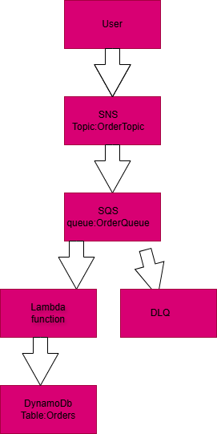

# Event-Driven Order Notification System - Setup Instructions

This guide provides step-by-step instructions to set up the Event-Driven Order Notification System using AWS services.

## Technologies Used
- Amazon SNS (Simple Notification Service)
- Amazon SQS (Simple Queue Service)
- AWS Lambda
- Amazon DynamoDB

## Setup Steps

### 1. Create DynamoDB Table
- Go to the AWS Management Console.
- Navigate to DynamoDB → Create Table.
- Table name: `Orders`
- Partition key: `orderId` (String)
- Add additional attributes:
  - `userId` (String)
  - `itemName` (String)
  - `quantity` (Number)
  - `status` (String)
  - `timestamp` (String)

### 2. Create SNS Topic
- Navigate to SNS → Topics → Create topic.
- Type: Standard
- Name: `OrderTopic`
- Create the topic.

### 3. Create SQS Queue
- Navigate to SQS → Create Queue.
- Type: Standard Queue.
- Name: `OrderQueue`.
- In the "Dead-letter queue" settings:
  - Create a Dead-Letter Queue (e.g., `OrderDLQ`).
  - Set `Maximum receives` to `3`.

### 4. Subscribe SQS Queue to SNS Topic
- Go to SNS → Topics → OrderTopic → Create subscription.
- Protocol: Amazon SQS
- Endpoint: Select `OrderQueue` ARN.
- Confirm the subscription.

### 5. Create AWS Lambda Function
- Navigate to Lambda → Create function.
- Runtime: Python 3.12 (or Node.js if preferred).
- Permissions: Attach a role with access to DynamoDB, SQS, and CloudWatch Logs.
- Function logic:
  - Read messages from SQS.
  - Parse the JSON.
  - Insert the order into the DynamoDB `Orders` table.
  - Log success/failure.
###6. create Lambda Trigger
  -Go to "Configuration" → "Triggers" → "Add trigger".
  -Select "SQS".
  -Choose OrderQueue.
  -Enable the trigger.
  -Save changes.
## Architecture Diagram

